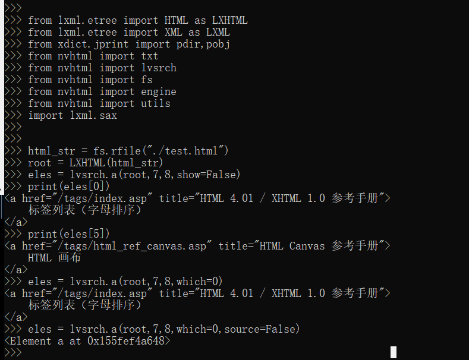

=====
Usage
=====

Command Line
------------
    
    ::
    
        nvhtml_beauty -input opis.html
        vim opis.html.out.html
        
        # nvhtml_beauty -h
        usage: nvhtml_beauty [-h] [-input INPUT_HTML_FILE] [-output OUTPUT_HTML_FILE] [-codec INPUT_CODEC]

        optional arguments:
          -h,           --help                      show this help message and exit
          -input        --input_html_file           input html file name
          -output       --output_html_file          output html file name
          -codec        --input_codec               input html file codec

        

Examples
--------

tagsrch
^^^^^^^

    ::
    
        from lxml.etree import HTML as LXHTML
        from lxml.etree import XML as LXML
        from xdict.jprint import pdir,pobj
        from nvhtml import txt
        from nvhtml import lvsrch
        from nvhtml import fs
        from nvhtml import engine
        from nvhtml import utils
        import lxml.sax
        
    :: 
    
        html_str = fs.rfile("./test.html")
        root = LXHTML(html_str)
        eles = lvsrch.a(root,7,8,show=False)
        print(eles[0])
        print(eles[5])
        eles = lvsrch.a(root,7,8,which=0)
        eles = lvsrch.a(root,7,8,which=0,source=False)

relation get
^^^^^^^^^^^^

:: 
    
    html_str = fs.rfile("./test.html")
    root = LXHTML(html_str)
    ele =  engine.xpath(root,"//div",5)
    
    engine.parent(ele)
    engine.grand_parent(ele)
    engine.ancestors(ele)
    engine.parent(ele)
    engine.grand_parent(ele)
    engine.ancestors(ele)
    engine.lsib(ele)
    engine.rsib(ele)
    engine.lcin(ele)
    engine.rcin(ele)
    engine.siblings(ele)
    engine.descendants(ele,5,6)
    
    engine.layer(ele)
    engine.breadth(ele)
    engine.depth(ele)
    engine.pathlist(ele)

description matrix
^^^^^^^^^^^^^^^^^^

:: 
  
    html_str = fs.rfile("./test.html")
    root = LXHTML(html_str)
    wfs = engine.WFS(root)
    pobj(wfs.mat[3][1])
    

width-first-traverse
^^^^^^^^^^^^^^^^^^^^
::

    html_str = fs.rfile("./test.html")
    root = LXHTML(html_str)
    pls = engine.wfspls(root)
    utils.parr(pls[:10])

depth-first-traverse
^^^^^^^^^^^^^^^^^^^^

::

    import lxml.sax
    html_str = fs.rfile("./test.html")
    root = LXHTML(html_str)
    dfs = engine.DFS()
    lxml.sax.saxify(root, dfs)
    utils.parr(dfs.pls[:5])
    utils.parr(dfs.pls[-10:])

beautify
^^^^^^^^

::

    html_str = fs.rfile("./test.html")
    root = LXHTML(html_str)
    html_str = engine.beautify(root)
    print(html_str[:480])

.. image:: ./images/engine.4.png

`lvsrch <./modules.html#module-lvsrch>`_
-----------------------------------------

.. code-block:: console

    [
     'a',
     'abbr',
     'acronym',
     'address',
     'applet',
     'area',
     'arguments',
     'article',
     'aside',
     'audio',
     'b',
     'base',
     'basefont',
     'bdi',
     'bdo',
     'big',
     'blockquote',
     'body',
     'br',
     'button',
     'canvas',
     'caption',
     'center',
     'cite',
     'code',
     'col',
     'colgroup',
     'command',
     'datalist',
     'dd',
     'del_',
     'details',
     'dfn',
     'dialog',
     'dir',
     'div',
     'dl',
     'dt',
     'elel',
     'em',
     'embed',
     'engine',
     'fieldset',
     'figcaption',
     'figure',
     'font',
     'footer',
     'form',
     'frame',
     'frameset',
     'h1',
     'h2',
     'h3',
     'h4',
     'h5',
     'h6',
     'head',
     'header',
     'hr',
     'html',
     'i',
     'iframe',
     'img',
     'input',
     'ins',
     'isindex',
     'kbd',
     'keygen',
     'label',
     'legend',
     'li',
     'link',
     'map',
     'mark',
     'menu',
     'menuitem',
     'meta',
     'meter',
     'nav',
     'noframes',
     'noscript',
     'object',
     'ol',
     'optgroup',
     'option',
     'output',
     'p',
     'param',
     'pre',
     'progress',
     'q',
     'rp',
     'rt',
     'ruby',
     's',
     'samp',
     'script',
     'section',
     'select',
     'small',
     'source',
     'span',
     'srch',
     'strike',
     'strong',
     'style',
     'sub',
     'summary',
     'sup',
     'table',
     'tbody',
     'td',
     'textarea',
     'tfoot',
     'th',
     'thead',
     'time',
     'title',
     'tr',
     'track',
     'tt',
     'u',
     'ul',
     'utils',
     'var',
     'video',
     'wbr',
     'xmp'
    ]

`engine <./modules.html#module-nvhtml.engine>`_
-----------------------------------------------

.. code-block:: console

    [
     'BEAUTIFY',
     'ContentHandler',
     'DFS',
     'WFS',
     'ancestor',
     'ancestors',
     'beautify',
     'between_levels_cond_func',
     'breadth',
     'child',
     'children',
     'copy',
     'default_wfs_handler',
     'depth',
     'descendants',
     'descendants_pls',
     'dfs_traverse',
     'dfspls',
     'disconnect',
     'elel',
     'extract_pls',
     'following_sibs',
     'grand_parent',
     'html',
     'init_cls_wfs_arguments',
     'is_leaf',
     'layer',
     'layer_wfs_handler',
     'lcin',
     'leaf_descendants',
     'leaf_descendants_pls',
     'loc',
     'loc2node',
     'lsib',
     'lxe',
     'lxml',
     'nonleaf_descendants',
     'nonleaf_descendants_pls',
     'parent',
     'pathlist',
     'plget',
     'preceding_sibs',
     'rcin',
     're',
     'rootnode',
     'rsib',
     'samepl_breadth',
     'samepl_siblings',
     'samepl_sibseq',
     'siblings',
     'sibseq',
     'source',
     'text_intag',
     'txtize',
     'utils',
     'wfs_traverse',
     'wfspls',
     'xpath',
     'xpath_levels'
    ]

